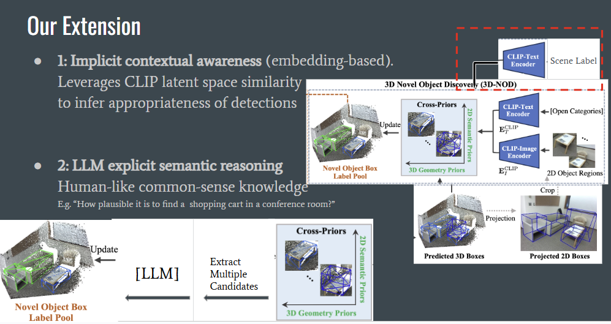
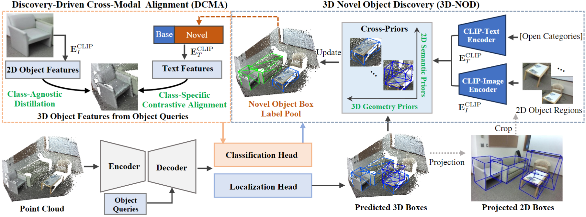
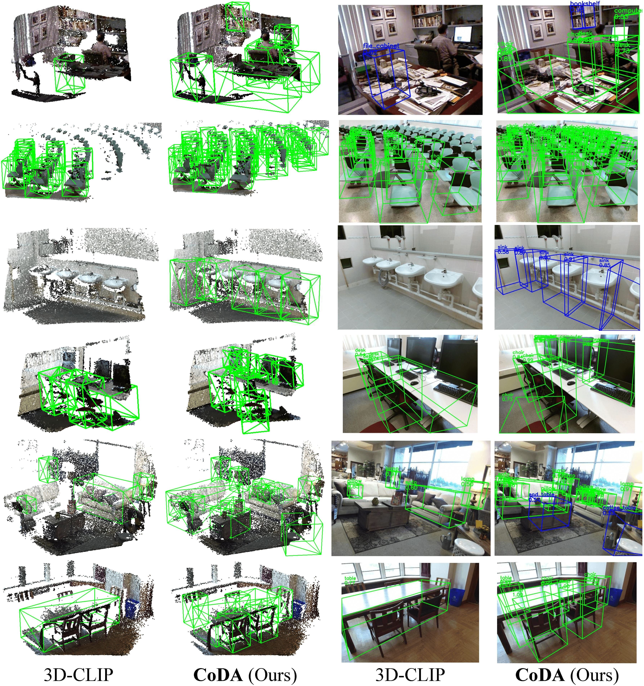

# Scene-Conditioned Novel Object Discovery in 3D Scenes (SC-NOD)

## Authors: 
Vadim Ezhov (vadim.ezhov@yale.edu), Jihe "Nick" He (nick.he@yale.edu), Xien Chen (xien.chen@yale.edu)


## Disclaimer: 
The "CoDA: Collaborative Novel Box Discovery and Cross-modal Alignment for Open-vocabulary 3D Object Detection (NeurIPS2023)" section below is the README from the original paper that this work extends on. 

Link to their GitHub: https://github.com/yangcaoai/CoDA_NeurIPS2023

## Abstract:
Open-vocabulary 3D object detection aims to recognize and localize both seen and unseen object categories within 3D scenes. Existing models perform well on frequent classes but often fail to detect rare or novel categories, limiting deployment in safety-critical domains such as autonomous driving. In this paper, we propose a method called Scene-Conditioned Novel Object Discovery (SC-NOD), which leverages scene context to guide open-vocabulary 3D object detection. By conditioning object category predictions on the scene label, we reweight the likelihood of candidate labels using CLIP-based semantic similarity. We further incorporate large language models to resolve ambiguous cases using contextual world knowledge. Our approach offers a lightweight but effective strategy to improve the identification of rare objects in 3D scenes, without requiring additional annotations.

Essentially, our approach, SC-NOD incorporates Similarity-based Scene Context Re-weighing (using CLIP embeddings) and LLM-based Context-aware Reranking (using Mistral LLM) into the original paper's 3D-NOD method. More details regarding the ideas and works behind the approach are described within our project paper.
We are also only interested in SUN-RGBD dataset, so SCANNET portions have been commented out.

Specific model versions- CLIP: ViT-B-16.pt. Mistral: Mistral-7B-Instruct-v0.2.



## Environment:
The dependencies follows pretty much the same as in the original paper, with some version differences. For us, since we had to set up the project, including all the datasets and model checkpoints, on Google Drive to use Google Colab, we have included a "terminal.ipynb" file within the root directory of our GitHub. It is a tutorial notebook that guides you through ALL the environment dependencies setup, data and model download, and evaluation running. ALL NEEDED COMMANDS AND TODO-STEPS ARE INCLUDED IN THAT NOTEBOOK. Please use the Colab Notebook on Google Colab, or whereever you see fit as you can adjust accordingly (since it's just a jupyter notebook).

*Additional note: since our approach did not involve an explicit training, we did not include the training script within the notebook. However, feel free to check out the commands for "Running Samples" under the original README. Since our modification didn't introduce or remove any parameters, the previous training commands should work. Check the repo script for more details on the arguments needed to resume training, etc.

*If the CLIP model isn't automatically downloaded, then add a "ViT-B-16.pt" checkpoint of the model under the CLIP folder.

## Changes introduced:
 - Extracted and aligned scene labels from the original SUNRGB-D dataset to the altered, modified SUNRGB-D dataset from the authors of the original paper, which did NOT include any scene label information. 
 - Modified sunrgbd_image.py to include scene_labels information.
 - Modified model_3detr.py to include the two SC-NOD modifications under the Model3DETRPredictedBoxDistillationHead module
 - Introduced llm_judge.py, which contains the pipeline for LLM-reranking. Implementation details and tuning logs are included in this file. This file also includes a READONLY HuggingFace login token to access the Mistral model.
 - Updated main.py and other bash scripts to exclude scannet and fix bugs incurred from newer versions of environment dependencies.
 - Introduced terminal.ipynb, the Google Colab notebook providing tutorials on environment setup, dataset and model download, and evaluation running. 

## Logs:
Our final one-shot in-context learning prompt looks like-

    "
    You are a detailed, knowledgeable, and realistic scene analyst.
    Your task is to determine how specifically and typically each object belongs to the given scene.
    Strongly prefer items uniquely or especially associated with that scene's function or activities, and give them significantly higher probabilities.
    Generic or broadly common items appearing in many places should have lower probabilities.
    Your ratings must reflect accurate, realistic real-world specificity and usage. Avoid equal or overly fair ratings.
    Give percentage probabilities in the range between 1 and 99 for each object, separated by ',' in terms of formatting.

    Example:  # must align with prompt!
    Your task: given the scene 'library', how relatively likely are \"bookshelf\", \"table\", \"sandcastle\", being in the scene, respectively?
    Scene: 'library'
    Objects: 'bookshelf', 'table', 'sandcastle'
    Reasoning: Both bookshelf and table are context-specific to the library, but table is more commonly found around places, while bookshelf is more unique to the setting so bookshelf is more preferred. Meanwhile, it is very unlikely for a sandcastle to appear in a library.
    Probabilities: bookshelf (90%), table (70%), sandcastle (1%)"  # purposefully degrading general objects

    Your task: given the scene '{scene_label}', how relatively likely are 
    + ", ".join(f"'{label}'" for label in candidate_labels)
    + being in the scene, respectively?
    "

Additional information on how we derived at one-shot in-context learning (also included in llm_judge.py):
Check 'multiple v4' at the bottom of the log to see our final derived output closely aligning with our desired behavior!

    # Tuning Logs #

    v1: (from v0)
    Cannot do 'a numerical prob.... between 0.0 and 1.0' because the LLM returns 0 often. So it is better to give it more degrees of freedom with "percentage" and apply a soft boundary "1 and 99"
    so the LLM cannot be overly uncertain or confident.
    However, the model is still outputting minimal, lowerbound probability, like 1. It's hard to rank the likelihood of an item existing in a scene in a general setting! So, similar to constrative
    learning, instead of asking f"Given the scene '{scene_label}', how likely is '{label}' being in the scene? Give a percentage probability in the range between 1 and 99." once for each object label in scene,
    we will ask: f"Given the scene '{scene_label}', how relatively likely are '{label_1}', ..., '{label_n}' being in the scene, respectively? Give a percentage probability in the range between 1 and 99 for each object, separated by comma."
    Also with larger LMs we are testing, it is better to do one-pass call instead of multiple, in terms of run time and compute usage.

    v2:
    However, even with Flan-t5-xl, the model is still performing suboptimally (though better in output format). Maybe the model is trying to be fair! So we add a context prefix to our prompt trying to place the LM
    in a setting that can remove the restrictions on fairness.
    Sadly, we think Flan is just not it. So we went to HuggingFace and setup Mistral-7B-Instruct-v0.2, and it performs much better!

    v3:
    However, the LM still prefers chair over wheelchairs for common objects in the hosptial. While this kind of makes sense since a hospital probably contains a lot more chairs for people to sit on instead of wheelchairs for the patients,
    we would not prefer this since chair is a more general object that can exist across a lot more contexts than wheelchair, and chair is less scarce than wheelchair! So, we want to highlight context-specific scarce object. Therefore,
    we modified the in-context learning prompt once more to instruct the model what to prioritize.
    Sadly, with zero-shot in-context learning, the model's output is still suboptimal. For example: Chair: 85%, Wheelchair: 50%, Dog: 10%. So, we attempt to do one-shot in-context learning.

    v4:
    We added reasoning and aligned the task example and run-time task's formats so the model can follow the chain of thought better. We also added a chain of thought reasoning to an analogous scenario of how to prefer scene-specific
    object over more general ones. Thus, we were abhle to achieve the desired outcome on the chair vs wheelchair example. However, since the input is too long, the output now repeats the input prompt.
    To mitigate this issue, we updated the numeric scores extractor to go backwards from the response so the run-time task's output can be correctly extracted. An alternative would be shortening the prompt.

    Flan-t5 (google/flan-t5-xl): google's seq2seq
    Mistral (mistralai/Mistral-7B-Instruct-v0.2): Causal LM

    # Model Outcome Logs #
    
    Flan-t5-base:
        single v1 - bad; ranking each object as minimum (0)
        multiple v1 - bad; ranking ALL objects with same probability '1' so default choice is outputted.

    Flan-t5-large:
        multiple v1 - bad; ranking ALL objects with same probability '1' so default choice is outputted.

    Flan-t5-xl: (takes longer)
        multiple v1 - bad; ranking ALL objects as same probability (11%).
        multiple v2 - bad; ranking ALL objects as same probability (11%).

    mistralai/Mistral-7B-Instruct-v0.2:
        multiple v2 - better. For example: Based on real-world common sense and typical hospital scenes, the probabilities would be as follows: chair: 95%, wheelchair: 85%, dog: 5%.

        multiple v3 - okay.... but still can't learn to prefer wheelchair. Also introduced prompt-repeating in the output.

        multiple v4 - works! Has prompt-repeating but it's fine if we increase output max token count. And learns to prefer wheelchair correctly with one-shot in-context learning.
            i.e. 
            Scene: 'hospital'
            Objects: 'chair', 'wheelchair', 'dog'
            Reasoning: Both chair and wheelchair are context-specific to the hospital, but wheelchair is more directly associated with the hospital's function, making it more likely to be present. 
            Dogs, while not unheard of in hospitals, are less common and more variable, so they have a lower probability.
            Probabilities: chair (80%), wheelchair (90%), dog (20%)
            Numeric Scores: [80.0, 90.0, 20.0]

            Scene: 'hospital'
            Objects: 'chair', 'dog', 'wheelchair'
            Reasoning: Chairs are a common piece of furniture found in hospitals, but wheelchairs are more context-specific to the setting. Dogs are not typically found in hospitals, but they can be present in certain areas like therapy dogs.
            Probabilities: chair (80%), dog (10%), wheelchair (90%)
            Numeric Scores: [80.0, 10.0, 90.0]

            *this shows that the rating remains correctly even with a different ordering of input objects! this shows that there is no position-bias in the one-shot in-context learning, and that this prompt + LM
            is position invariant.


## :book: CoDA: Collaborative Novel Box Discovery and Cross-modal Alignment for Open-vocabulary 3D Object Detection (NeurIPS2023)
<p align="center">
  <small> 🔥Please star CoDA ⭐ and share it. Thanks🔥 </small>
</p>

> [[Paper](https://arxiv.org/abs/2310.02960)] &emsp; [[Project Page](https://yangcaoai.github.io/publications/CoDA.html)] <br>
<!-- > [Yang Cao](https://yangcaoai.github.io/), Yihan Zeng, [Hang Xu](https://xuhangcn.github.io/), [Dan Xu](https://www.danxurgb.net) <br> -->
<!-- > The Hong Kong University of Science and Technology, Huawei Noah's Ark Lab -->
> [Yang Cao](https://yangcaoai.github.io/), Yihan Zeng, [Hang Xu](https://xuhangcn.github.io/), [Dan Xu](https://www.danxurgb.net) <br>
> The Hong Kong University of Science and Technology<br>
> Huawei Noah's Ark Lab

:triangular_flag_on_post: **Updates**  

&#9745; As the first work to introduce 3D Gaussian Splatting into 3D Object Detection, 3DGS-DET is released [here](https://arxiv.org/pdf/2410.01647) !

&#9745; Our extended work **CoDAv2** is released, check out it on [arXiv](https://arxiv.org/abs/2406.00830) !

&#9745; Latest papers&codes about open-vocabulary perception are collected [here](https://github.com/yangcaoai/Awesome-Open-Vocabulary-Perception).

&#9745; All the codes, data and pretrained models have been released!

&#9745; The training and testing codes have been released.

&#9745; The pretrained models have been released.

&#9745; The OV-setting SUN-RGBD datasets have been released.  

&#9745; The OV-setting ScanNet datasets have been released.

&#9745; Paper LaTeX codes are available at https://scienhub.com/Yang/CoDA.

## Framework  


## Samples  


## Installation
Our code is based on PyTorch 1.8.1, torchvision==0.9.1, CUDA 10.1 and Python 3.7. It may work with other versions.

Please also install the following Python dependencies:

```
matplotlib
opencv-python
plyfile
'trimesh>=2.35.39,<2.35.40'
'networkx>=2.2,<2.3'
scipy
```

Please install `pointnet2` layers by running

```
cd third_party/pointnet2 && python setup.py install
```

Please install a Cythonized implementation of gIOU for faster training.
```
conda install cython
cd utils && python cython_compile.py build_ext --inplace
```

## Dataset preparation

To achieve the OV setting, we re-organize the original [ScanNet](https://github.com/facebookresearch/votenet/tree/main/scannet) and [SUN RGB-D](https://github.com/facebookresearch/votenet/tree/main/sunrgbd) and adopt annotations of more categories. Please directly download the ov-setting datasets we provide here: [OV SUN RGB-D](https://hkustconnect-my.sharepoint.com/:f:/g/personal/ycaobd_connect_ust_hk/EqeHrtMq5aZBmnZUR79vub4B9HZIBxYLd5K7z6VuvemHzg?e=e7ooDv) and [OV ScanNet](https://hkustconnect-my.sharepoint.com/:f:/g/personal/ycaobd_connect_ust_hk/EsqoPe7-VFxOlY0a-v1-vPwBSiEHoGRTgK5cLIhnjyXiEQ?e=jY7nKT). 

Then run for the downloaded *.tar file:
```
bash data_preparation.sh
```

## Evaluation
Download the pretrained models [here](https://drive.google.com/file/d/1fTKX1ML5u8jJ249GwAYqdCZGs941907H/view?usp=drive_link).
Then run:
```
bash test_release_models.sh
```

## Training
```
bash scripts/coda_sunrgbd_stage1.sh
bash scripts/coda_sunrgbd_stage2.sh
```
## Running Samples
```
bash run_samples.sh
```

## :scroll: BibTeX
If CoDA is helpful, please cite:
```
@inproceedings{cao2023coda,
  title={CoDA: Collaborative Novel Box Discovery and Cross-modal Alignment for Open-vocabulary 3D Object Detection},
  author={Cao, Yang and Zeng, Yihan and Xu, Hang  and  Xu, Dan},
  booktitle={NeurIPS},
  year={2023}
}

@misc{cao2024collaborative,
      title={Collaborative Novel Object Discovery and Box-Guided Cross-Modal Alignment for Open-Vocabulary 3D Object Detection}, 
      author={Yang Cao and Yihan Zeng and Hang Xu and Dan Xu},
      year={2024},
      eprint={2406.00830},
      archivePrefix={arXiv},
      primaryClass={cs.CV},
      url={https://arxiv.org/abs/2406.00830}, 
}
```

## :e-mail: Contact

If you have any question or collaboration need (research purpose or commercial purpose), please email `yangcao.cs@gmail.com`.

## :scroll: Acknowledgement
CoDA is inspired by [CLIP](https://github.com/openai/CLIP) and [3DETR](https://github.com/facebookresearch/3detr). We appreciate their great codes.
